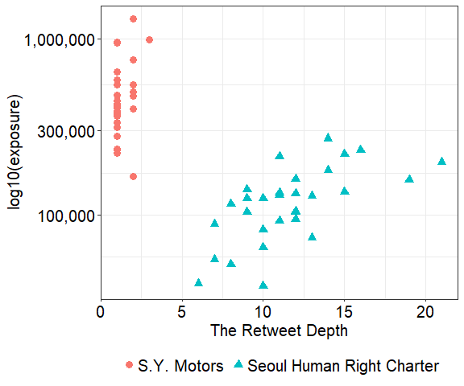

hw03 part 2
================
Donghyun Kang

``` r
library(ggplot2)
library(scales)

df <- read.csv("depth_exposure.csv", header = TRUE)
gg <- ggplot(df, aes(x=rt_depth, 
                     y=exposure,
                     shape = case, 
                     color = case)) +
      geom_point(size = 3)

gg <- gg + scale_y_log10(labels = comma)
gg <- gg + theme_bw() + 
  theme(text = element_text(size = 15, color = "black"), 
        axis.text.x = element_text(color="black", size = 15),
        axis.text.y= element_text(color= "black", size = 15))

gg <- gg + ylab('log10(exposure)') + xlab("The Retweet Depth")

gg <- gg + theme(legend.position = "bottom",
                 legend.title = element_blank(), 
                 legend.text=element_text(size=15))
gg
```



For this assignment, I decided to revisit one of the figures in my master’s thesis in which I studied how messages regarding two different types of protest events were diffused through Twitter. The above scatter plot presents the relationship between the retweet depth (X-axis) and the exposure of tweets of the top 30 most popular tweets about each protest events in terms of the number of retweets.

In total, they constitute 60 observation points. The pink and blue-green dots correspond to the top 30 tweets regarding a laborer issue and the LGBTQ issue, respectively, tweeted in South Korea 2014-15. I will first explain the meaning of the metrics on the X and Y-axis and start to evaluate the graph, using the five criteria. The retweet depth refers to the step of the cascade of tweets. For example, if a tweet written by user A was retweeted by user B, and user C retweeted the original message from A via the tweet from B (which can be simply put as A → B → C), the retweet depth of this specific case is 2. The exposure for each tweet was counted based on the following network. It basically refers to the number of users whose timeline showed the original message, which is equivalent to the size of the union of followers of users who retweeted the tweet and plus the follower of the user who initially composed the tweet. In other words, it captures the number of maximum users who had a chance to read the message on their timeline.

Now, let’s evaluate the graph. Is it *truthful*? I believe it is. Perhaps I am more leaning towards a positive answer just because I made it in the first place; however, I think my decision to examine the relationship between the two metrics was legitimate not only just because the graph successfully captures the variation of the two cases, but also because I chose the two metrics based on the existing literature arguing that the size of follower does not necessarily determine the influence (Cha et al., 2010) in terms of generating cascades of retweeting. Having this point in mind, I decided to check whether the underlying mechanism governing the diffusions of messages about each issue was similar or different. However, one possible criticism is that the cut point - top 30 popular tweets in the number of retweets - was somewhat arbitrary, even though (I think) there is no consensus on the cut point that guarantees the representativeness.

Is it *functional*? I think it is. I chose to use different shape and color for each issue so that readers can see the two dissimilar patterns without taking lots of efforts. I expected that the two different shapes would distinguish the two issues even if the graph is printed on a grey scale. Furthermore, I intentionally transformed the Y-axis into a log scale with base 10 but used the original size to convey a sense for the number of people who were potentially exposed to the tweet messages. If I used a natural logarithm, the Y-axis would be less interpretable. And thanks to ggplot2 in R, I think the graph looks quite pretty, which gives a positive answer to the question of whether it is *beautiful*. I could have removed all the grids, but I decided not to because I think it also helps readers to get a quick sense of the locations of each point.

Is it *insightful* and *enlightening*? I created this graph to display that totally different two mechanisms worked in the two events: in the S.Y. Motors case, the Twitter was used as a broadcast system while it functioned as a medium for a word of mouth in the LGBTQ issue. I think the graph conveys the difference spontaneously. When I presented this work at a poster session in a conference (NetSci 2016), it truly attracted some attention. And since nobody had a chance to compare the two types of protests - namely the old social movement (labor movement) and the new social movements (including the issue of LGBTQ’s right) - in Twitter space before, I felt that I was producing new knowledge when I analyzed the data. I also had an opportunity to talk to some activists in both camps and they enjoyed listening to my interpretation about it. I think this suggests that I did justice with the dataset, which implies that the graph is enlightening as well.

***References***

Cha, Meeyoung, Hamed Haddadi, Fabricio Benevenuto, and Krishna P. Gummadi. "Measuring user influence in twitter: The million follower fallacy." In fourth international AAAI conference on weblogs and social media. 2010.

Donghyun Kang, "Hierarchy and Modularity, the Two Organizing Mechanisms of Protests in SNS: The Case Study of Rainbow Occupy Seoul City Hall and Smokestack Protest of SsangYong Motor’s Dismissed Workers" (abstract number 1279), NetSci 2016, June 2016, Seoul, Korea
